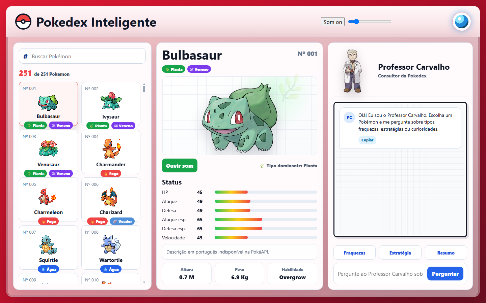
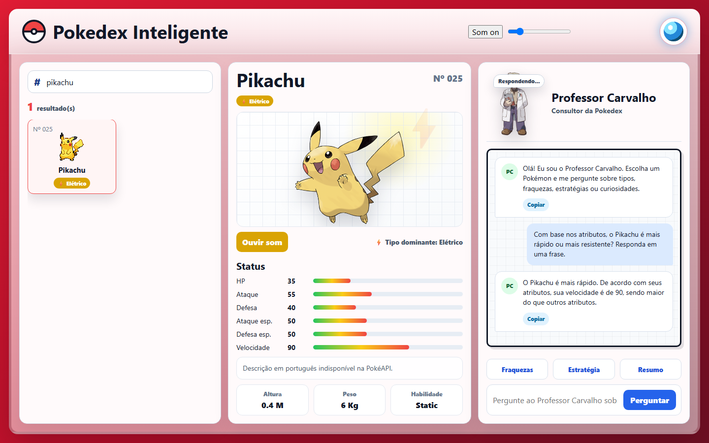

# Pokédex AI


Uma Pokédex das duas primeiras gerações com um assistente de IA: escolha um Pokémon, veja seus dados e converse com o **Professor Carvalho** sobre tipos, fraquezas e estratégias. O chat responde com o contexto do Pokémon selecionado.

Projeto originado de um desafio técnico de estágio em Engenharia de Software, evoluído para funcionar em qualquer sistema e sem depender de chaves de API.





> O print do chat foi gerado com o modelo `mistral` rodando localmente no Ollama.

## Funcionalidades

- Lista dos 251 Pokémon (Gerações 1 e 2), com busca por nome e carregamento em lotes.
- Detalhes com arte oficial, tipos, atributos, altura, peso, habilidade e som.
- Chat com o Professor Carvalho, que recebe tipos, habilidades e atributos do Pokémon como contexto.
- LLM configurável: **Ollama local** (sem chave e sem custo) ou **OpenRouter** (opcional).
- O backend intermedia a chamada à LLM, então nenhuma chave chega ao navegador.

## Stack

| Camada | Tecnologias |
| --- | --- |
| Frontend | React 19, Vite |
| Backend | FastAPI, httpx, python-dotenv |
| Dados | [PokeAPI](https://pokeapi.co) |
| LLM | Ollama (local) ou OpenRouter |
| Qualidade | ESLint, pytest, GitHub Actions |

## Como funciona

```text
Navegador ──► React (Vite)
                 ├──► PokeAPI          (lista e detalhes dos Pokémon)
                 └──► FastAPI /chat/   ──► Ollama (padrão)
                                       └─► OpenRouter (se houver chave)
```

Em produção (`npm start`), o próprio FastAPI serve o build do frontend, então tudo roda em uma única porta.

## Como rodar

Requisitos: **Node.js 18+** e **Python 3.10+**. Funciona em Windows, macOS e Linux.

```bash
git clone https://github.com/Feduzo/pokedex-ai.git
cd pokedex-ai
npm start
```

Acesse **http://localhost:8000**.

Na primeira execução o script `scripts/run.mjs` cuida de tudo:

1. cria o ambiente virtual e instala as dependências do backend e do frontend;
2. pergunta pela sua chave do OpenRouter. Se você apertar **Enter**, ele usa o **Ollama local**: instala (com confirmação), inicia o serviço e baixa o modelo `llama3.2`;
3. gera o build do frontend e sobe o servidor.

Sua escolha fica salva em `backend/.env`, que é ignorado pelo Git.

### Escolhendo a LLM

| Opção | Como usar |
| --- | --- |
| **Ollama local** (padrão) | Nada a configurar. Manualmente: instale o [Ollama](https://ollama.com) e rode `ollama pull llama3.2`. |
| **OpenRouter** | Crie uma chave gratuita em [openrouter.ai/keys](https://openrouter.ai/keys) e coloque em `backend/.env`. Com a chave definida, ela tem prioridade sobre o Ollama e usa um modelo gratuito (`:free`). |

```bash
# backend/.env
OPENROUTER_API_KEY=sua_chave_aqui
```

Variáveis opcionais: `OPENROUTER_MODEL`, `OLLAMA_URL` e `OLLAMA_MODEL` (veja `backend/.env.example`).

> Nunca versione o `.env`. A chave fica só na sua máquina.

### Modo desenvolvimento

```bash
npm run dev
```

Backend com reload em `http://localhost:8000` e frontend com hot reload em `http://localhost:5173`.

## Testes e qualidade

```bash
npm test        # testes do backend (pytest)
npm run lint    # ESLint no frontend
npm run build   # build de produção
```

O CI (GitHub Actions) roda lint, build e testes a cada push.

## Decisões técnicas

- **Backend como intermediário da LLM:** evita expor chaves no frontend e permite trocar de provedor sem mexer na interface.
- **Provedor com fallback:** se não há chave, o app usa o Ollama local. Assim o projeto roda para qualquer pessoa, sem cadastro nem custo.
- **Configuração lida na hora da chamada:** as variáveis de ambiente são resolvidas dentro da função, e não na importação do módulo, para respeitar o `.env` carregado pelo `load_dotenv()`.
- **Lista carregada em lotes:** evita uma tela travada enquanto os 251 Pokémon chegam.
- **Prompt com contexto:** tipos, habilidades e atributos do Pokémon vão junto da pergunta para respostas mais precisas.
- **Uma porta só em produção:** o FastAPI serve o build do frontend, o que simplifica rodar e demonstrar.

## Licença

[MIT](LICENSE)
